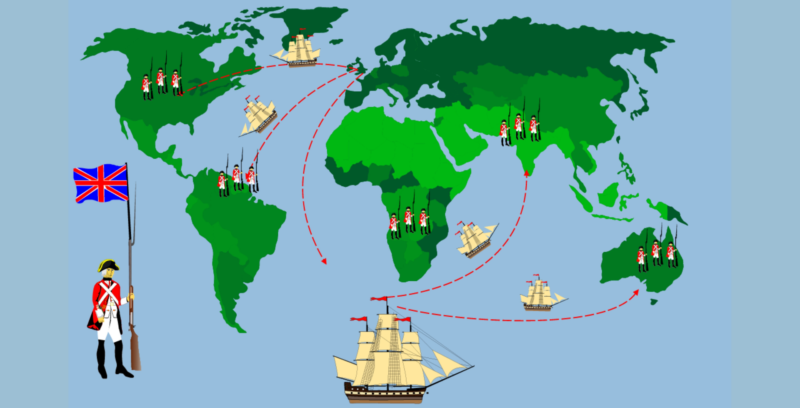
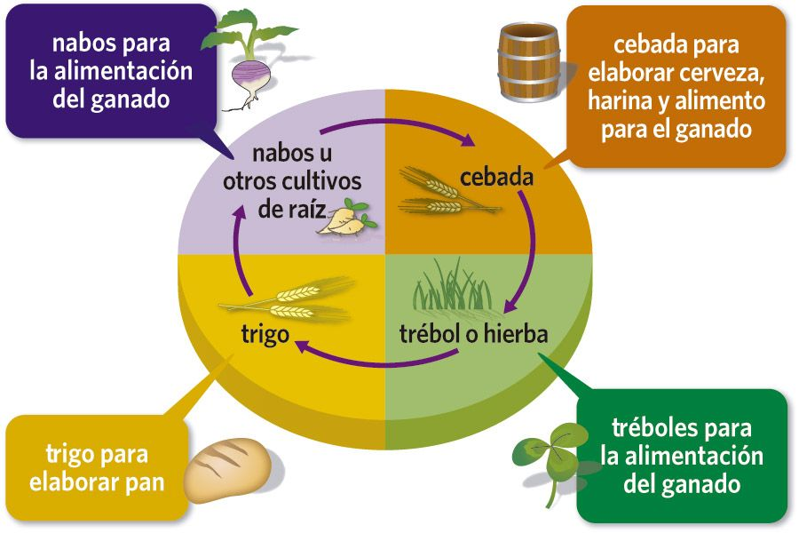

<!--Necesario-->
```{r setup, include=FALSE} 
knitr::opts_chunk$set(echo = TRUE)
```


# REVOLUCIÓ AGRÀRIA I DEMOGRÀFICA 
## Revolució Agraria
### Causes
  - Innovacions Agricoles
    - ~~Guaret~~ → Sistema Norkfolk
    - ...
  - Nous terrenys
  - Llavors i espècies noves 
    - Creïlla
    - Dacsa
  
     
    
### Lloc, Data
Aquesta revolució es va produir cap a la fi del segle XVIII a gran Bretanya la qual en aquest moment va tenia moltes colonies: Jamaica, part del Carib, Irlanada...



### Descripició
  Respecte a la innovacio de tècniques, l'introducció del sistema de Norkfol el qual consisteix en fer una rotació quadriennal.Va substituir al guaret perqué al guaret solamanet s'aprofitaben únicament dos terços d etota la collita. A més es va fer popular l'us de la arau d'animals. Aixó, amb  l'habilitció de nous terrenys per a sembrar i la introducció de noves espècies de plantes importades d'Amèrica i India . Va fer que en poc temps tot el relauti a la agricultura es desarollara de foroma més ràpid.
  

### Conseqüenciès
- Aument del CR
- Emigració cap a la ciutat
- Inversió del capital en la industrial

## Explica de la revolució demogràfica
### Com era la situació de la població europea a finals del s. XVIII?
### On, Quan i Què va passar?
### Per què?
### Quines conseqüències va tindre l’augment de la població?
# ELS INICIS DE LA INDUSTRIALITZACIÓ 
## Què, On i Quan?
## Per què? (Causes de la Revolució industrial)
## Com es va desenvolupar la industrialització? (Les primeres indústries: fonts d’energia, matèries primàries i tipus d'indústria)
## I després?... L’expansió internacional de la industrialització.
# LA REVOLUCIÓ DELS TRANSPORTS 
## Introducció:
### Com era la situació dels mitjans de transport a finals del s. XVIII?
### Què va canviar, per què i quan?
## Explica les transformacions del ferrocarril.
## Explica l’aparició dels vaixell de vapor i com es transformaren les travessies marítimes.
## Explica la importància que tindria posteriorment l’aparició de l’automòbil i l’avió.
# EL TRIOMF DEL CAPITALISME 
## Què és el capitalisme?
## Com va sorgir? (El capitalisme liberal)
## El capitalisme va sorgir i agafà forma amb el sistema industrial de producció.
Investiga i recorda com era sistema artesanal del gremis i compara’l amb el
sistema industrial de producció.
## El capitalisme va evolucionar cap a un capitalisme financer. En què va consistir?

# LA SOCIETAT DE CLASSES 
## En què va consistir la transformació de la societat? (La societat estamental i la industrial)
## Explica detalladament les característiques de la burgesia.
## Explica qui era el proletariat, com eren les condicions de treball que tenien i com era la seua vida en el s. XIX.
# EL MOVIMENT OBRER 
## Què és el moviment obrer i per què va sorgir?
## Com va sorgir l’obrerisme?
## Què és el socialisme?
### Explica els diferents tipus de pensament socialista: què proposen i com volien aconseguir els seus objectius?
## Què és l’anarquisme, què proposa i com pretenia aconseguir els seus objectius?
## La Internacionals obrera:
### Què va ser?
### Per què va sorgir? On? Quan?
### A quines dificultats es va enfrontar?
# L'EXPANSIÓ DE LA INDUSTRIALITZACIÓ
## La segona revolució industrial (Què? Quan? Per què?)
## Quines novetats va aportar la segona revolució industrial?
### Noves energies
### Noves indústries
### Nous sistemes productius
### Noves formes d’organització empresarials (Concentració empresarial què és i tipus?)
### Noves potències mundials
# LA INDUSTRIA A L’ACTUALITAT
## La tercera revolució industrial (Què? Quan? Per què?)
## Quines novetats està aportant la tercera revolució industrial?
### Noves energies
### Noves indústries
### Nous sistemes productius
### Reptes de la industria actual
### Potències industrials actuals


