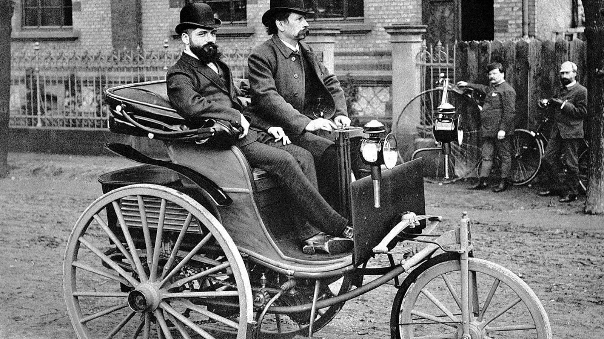

<!--Necesario-->
```{r setup, include=FALSE} 
knitr::opts_chunk$set(echo = TRUE)
```


# REVOLUCIÓ AGRÀRIA I DEMOGRÀFICA 
## Revolució Agraria
### Causes
  - Innovacions Agricoles
    - ~~Guaret~~ → Sistema Norkfolk
    - ...
  - Nous terrenys
  - Llavors i espècies noves 
    - Creïlla
    - Dacsa
  - Privatizació de la terra
  
  
  
     
    
### Lloc, Data
Aquesta revolució es va produir cap a la fi del segle XVIII a gran Bretanya la qual en aquest moment va tenia moltes colonies: Jamaica, part del Carib, Irlanada...


### Descripició
  Respecte a la innovacio de tècniques, l'introducció del sistema de Norkfol el qual consisteix en fer una rotació quadriennal.Va substituir al guaret perqué al guaret solamanet s'aprofitaben únicament dos terços d etota la collita. A més es va fer popular l'us de la arau d'animals. Aixó, amb  l'habilitció de nous terrenys per a sembrar i la introducció de noves espècies de plantes importades d'Amèrica i India . Va fer que en poc temps tot el relauti a la agricultura es desarollara de foroma més ràpid.
  

### Conseqüenciès
- Aument del CR
- Emigració cap a la ciutat
- Inversió del capital en la industrial


## Revolució Demogràfica
### Situació a finals del segle XVIII
A meitat el segle XVIII la població va esperimentar un creixement real(la resta entre naixements y morts produit) exponencial; es a dir que creix molt en poc temps

### Descripció
  - La taxa de Natalitat va aumentar drasticament.
  
  <!--Espacio reservado para la formula de la tasa de Natalidad-->
  
  - La taxa de mortalitat es va reduir
  
    <!--Espacio reservado para la formula de la tasa de Mottalidad-->
    
  - Com a conseqüència del dos punts anteriors el creixement real va a aumentar
  
    <!--Espacio reservado para la formula del crecimiento real gráfico que muestra la evolución de la TN, la TM y el CR a lo largo del siglo XVIII-->  
    
### Lloc, Data
  Aquest canvi es va produir en Europa, però sobretot a Anglaterra. Va començar durant el segle XVIII i es podria dir que continua indefinidament.
  
### Causes
- Aument del exedent agrari
- Millora de l'alimentació i la higiene
- Avanços mèdics i sanitaris
- Canalització del aigua
- Major us del Sabó


### Conseqüències
- Augment de la mà d'obra
- Augment de la demanda del aliments i productes manufacturats
- Augment de les ciutats

# ELS INICIS DE LA INDUSTRIALITZACIÓ 
## Descripció
A la meitat del segle XVIII es va produir a Gran Bretanya varios canvis econòmics, com a conseqüència d'aixo es va produir la Revolució industrial.  en la qual es varen donar molts avanços a nivell Social-Econòmic en poc temps.

## Causes
- Creixement de la població
  - (aument de la demanda)
- Avançós tècnics
  - Energia
  - Siderúrgia
  - Tèxtil
- Xarxa de comunicacions
  - Canals navegables
- Burgesia amb mentalitat d'empresaris


## Proces de la industralització

Desenvolupament de les indústries: téxtil i siderúrgica

### Téxtil
  Com a conseqüència de l'augment de la població el primer sector en industrialitzar-se va ser el téxtil per l'augment de la població y les materies primes importades de les colònies
  


### Siderúrgica

L'hulla un tipo de carbó va aumentar la qualitat del ferro que es va utilitzar per a els transports


## Expansió internacional
 1. Anglaterra
 2. Europa
    - França
    - Bèlgica
    - Alemanya
 3. EUA i Japó
 
Tot aixó es pot veure reflectit en aquest mapa
  

# LA REVOLUCIÓ DELS TRANSPORTS 
## Introducció
### Situació al segle XVIII

Els únics sistemes de tranports eren els tradicionals (vent, aigua i força animal)
  
### Descripció 
Al segle XIX es va comená a aplicar la maquina de vapor als medis de transports. Ja que la gent tenia la necesitat de desplazarse a una rapidesa superior.

## Ferrorocaril
- ~~Vagonestes de tracció animal~~ → Locomotora a Vapor
- En 1825 es va inagurar la primera lienea de ferrocaril
- En 1830 primera línia amb passatgers
- Durant el reste del segle XIX es va perfeccionar la locomotora


## Vaixell de vapor i travessies marítimes

- En 1803 es va idear la idea del vaixell de vapor
- En 1807 va fer la seva primera travessiaente Nova York i Albany (mediant el riu Hudson)
- En 1819 un vaixell va creuar el oceà atlàntic
- A mitjans del segle XIX el us del vaixell es va estendre
- A la fi del sele XIX el 67% dels vaixells eran de vapor
- Més abant s'introduira el casc de Ferro y de Hèlix, a més del canvi de grandaria
- Va ser molt utilitzat per al comerç


## L'automòbil i l’avió

- Es varen crear amb el motord'explosió
- En 1885 K. Benv va utlitzar el motiu de gasolina en els seus automòbils
- En 1903 els germans Wright van fer el primer vol amb avió




# EL TRIOMF DEL CAPITALISME 
## Descripció
  El capitalisme és un sistema econòmic que es va instaurar entre el propietaris i els inversors de les fabriques
  

  
## Aparició
  El capitalisme va apareixer durant la revolució industrial. Las idees econòmiques anavan lligades a la burgesia, es basa en la societat privada. El lliurecanvisme va substituir al ~~proteccionisme~~, impulsat per Adam Smith.


### LLiurecanvisme

- Comerç Internacional
- Lliure competencia
- ~~Intervenció del estat~~
- ~~Proteccionisme~~

## Sistema Anterior / Sistema Industrial de Producció

### Sistema Anterior (Gremis)
  - Gremis, agrupació de persones del mateix ofici controlava la producció
  - Els gremis tenian el su propi escalfó
    - Aprenent
      - Viu al gremi
      - No te remuneració econòmica
    - Oficial
      - Te remuneració economica
    - Mestre Artesá
      - Dirigeix el gremi
  - Tot el procés o fa una persona


### Sistema Industrial
  - Es treballa a una fàbrica
  - Producció a gran escala
  - Treballador sense cap qualificació
  - Tasca molt específica
  

      

## Capitalisme financer

- Creacció de les societats anonimes
  - El capital per a una inversió provenia d'una associació de  burgesos
  - Cada part de l'empresa era una acció que es venia a la borsa
- La banca va comenár a inventir


# LA SOCIETAT DE CLASSES 
## Introducció
  - Canvis dratics en la societat:
  
  - ~~Aritocràcia~~
  - ~~Artesans~~
  - Burgesia ↑
  - Proletariat ↑
  
## Burgesia
 - Propietats de mitjans de producció
    - Maquines
    - Capital
    - ...
 - Família va ser básica
  - Matrimoni
 - Mansió
 - Higiene (a partir del segle XX)
 - Vida Social
  - Casinos
  - Cafe


## Proletariat (Segle XIX)

  - Obresrs per a les fàbriques
    - Força de treball
    - Salari
  - Llarges jornades laborals 
    - 14 - 16 hores
  - DeshumanitzacióS
  - Incorportació infantil i femenina
  - Poca higiene
  - Escàs temps d'oci


  
# EL MOVIMENT OBRER 
## Descripció

Es un moviment que va sorgir en contra del capitalisme i la industralització habia generat.


## Origen
- 1811 manifestacions *moviment ludita*: alguns obrers trencan maquines
- Es varen crear associasons de com **mútues** o societasts de socors
- 1824: Creació del sindicats
    
  
## Socialisme
Moviment que promou la igualtat en persones

### Tipus

#### Socialime Utòpic

Societat fraternal i solidària . Fomenta el cooperatisme (~~Individualisme~~)

#### Socialisme Científic

Més racional que el Utòpic. Inpulsat per Karl Marx. També conegut com Marxalisme o comunisme


  

## Anarquisme
- Supressió del estat (~~Estat~~)
- ~~Capitalisme~~
- ~~Desigualtat econòmica~~
- ~~Eleccions~~
- Mikhaïl Bakunin


## La Internacional obrera:
### Descripció
Agrupació de treaballadors francesos i britànics, que volien enfortir la solidaritat internacional

### Causes
- Obrers es van donar compta de que tenien els matixos problemes en diferents països

#### Data
  En 1864 varen formar la pimera Associació internacional de treballadors (AIT) O Primera internacional obrera.E n 1876 se va dissoldre. En 1889 la Segona internacional obrera

#### Lloc

La primera interncional va ser en Londres i la Segona internacional obrera a Paris


  
### Problemes 

En 1876, com entre els marxistes, obreristes i anarquitstes  no arribaven a un acord la societat es va disoldre.


# L'EXPANSIÓ DE LA INDUSTRIALITZACIÓ
## Descripció
  Va consistir en un altre canvi de la societat i la tecnològia en poc temps
  
### Temps
  - Últim terç del segle XIX
  
### Causes
- Impulsos
  - Tecnològic
  - Científic 
- Factors
  
  - Econòmics
  - Laborals

## Novetats
### Energia
- El Petroli
  - Gasolina
  - Fuel
  - Gasoil


- L'electricitat
  - Invenció del la dinamo
  - El telefon
  

  
### Indústries
  - Siderometal·lúrgica
    - Nous metals
      - Alumini
      - Coure
  - Química
    - Fertilitzants
    - Explosius
    - Sintètics
  

  
### Sistemes productius

- En sèrie: Treball en series breus de temps cronometrades

- En Cadena: Diferents treballadors intervenen en el diferent procés de fabricació


### Concentració Empresarial
  Consisteix en diferent formes que tenen las empresad d'agruparse

#### Càrtel
 Empreses és junten però mantenen la seva independència
 
#### Trust
  
  Empreses és junten en una mateixa empresa, sense mantenir la seva independència

#### Hòlding
  Una empresa treballa en distints negocis
  


  
## Noves potències mundials
- França: Rica en recursos minerals
- Bèlgica: grans reservas de carbó
- Alemanya: gran mercart interior
- Japó: El seu proces de desnvolupament va intervindre el estat
- Estats Units: Gran industrialització

# TERCERA REVOLUCIÓ INDUSTRIAL

## Descripció
Es un altre proces de canvis rápids en molt poc temps, esta revolució va començar a l'última part del segle XIX però no va tindre molta repercusió en la societat fins al principi del segle XXI.

### Causes
 - Nous mitjans de comunicació
 - Nous mitjans de transports 
 - Especialització de les persones    

## Novetat
### Noves energies

#### Energias renovables
<table class="demo">
<tbody>
<tr>
<th>ENERGIA</th>
<th>AVANTATGES<br></th>
<th>INCONVENIENTS</th>
<th>EXEPLES D'US<br></th>
</tr>
<tr>
<td>Hidráulica</td>
<td>El moviment del aigua tranformat en energia</td>
<td>Instal·lació costosa<br></td>
<td>Pressas</td>
</tr>
<tr>
<td>Solar</td>
<td>Captar la radiacció del sol i tranformar-la en energia</td>
<td>Instal·lació costosa i necesita grans extensions <br></td>
<td>Hospitals i hotels solars<br></td>
</tr>
<tr>
<td>Eòlica</td>
<td>Força del vent transformada en energia</td>
<td>Alteració de paisatges i problemes de fauna (aus)<br></td>
<td>En la ramaderia<br></td>
</tr>
<tr>
<td>Biomassa</td>
<td>Combustió de llenya <br></td>
<td>Emissions</td>
<td>Calefaccions</td>
</tr>
<tr>
<td>Geotermica<br></td>
<td>Aprofitar el calor de la terra<br></td>
<td>Transformació del paisatge<br></td>
<td>Calefaccions</td>
</tr>
<tr>
<td>Maremotriu</td>
<td>Transformar en energia els moviments de las mareas<br></td>
<td>No rentable<br></td>
<td>Suministrar energia als ports maritims<br></td>
</tr>
</tbody>
</table>


### Indústria
- Tecnologia aeronauticas
- Energias reonvables
- Biotecnologia
- Industria de les "TICS"
  - Tecnologia de la Informació i la comunicació
  
  
  
### Sistemes productius
  
- Just in time: sistema en el qual es produeix a memanda i no s'amagatzena res

  

### Reptes de la industria actual
  
  - Digitalització: Un process per el qula la tecnologia digital s'implanta en l'economia de la empresa. El problma que sque digitalitzar una empresa te un cost molt elevat

### Potències industrials actuals

- Els Brics
  - Gran extensió territorial
  - Emergents
  

<bR>

- "Els de sempre" (Japó, Anglaterra...)


<bR> <br> <hr>

GitHub: [https://github.com/JavierRibaldelRio](https://github.com/JavierRibaldelRio)
